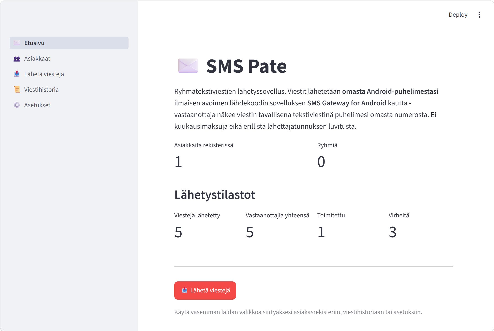
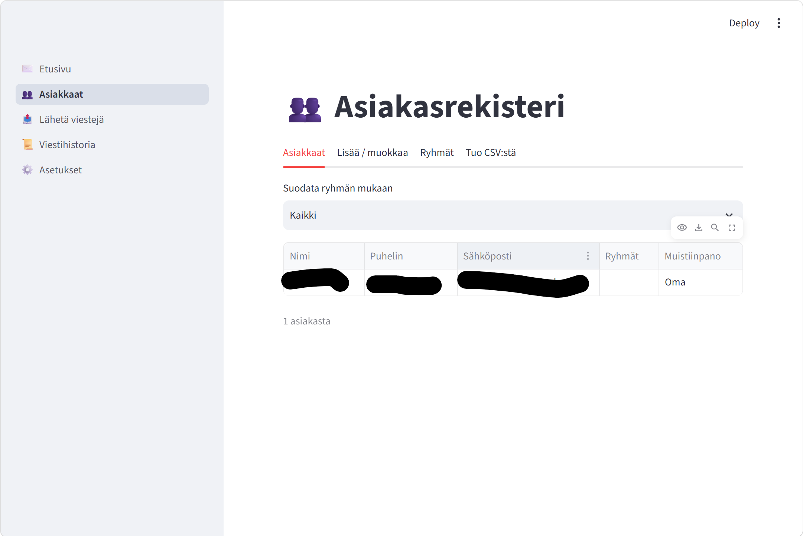
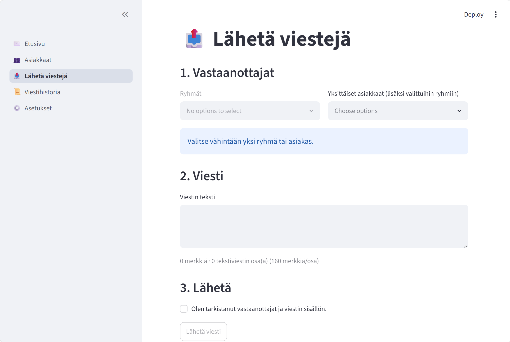
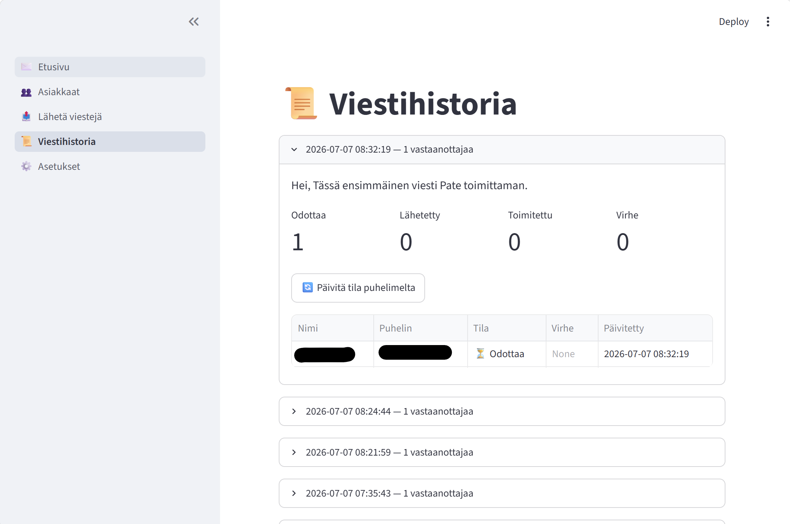
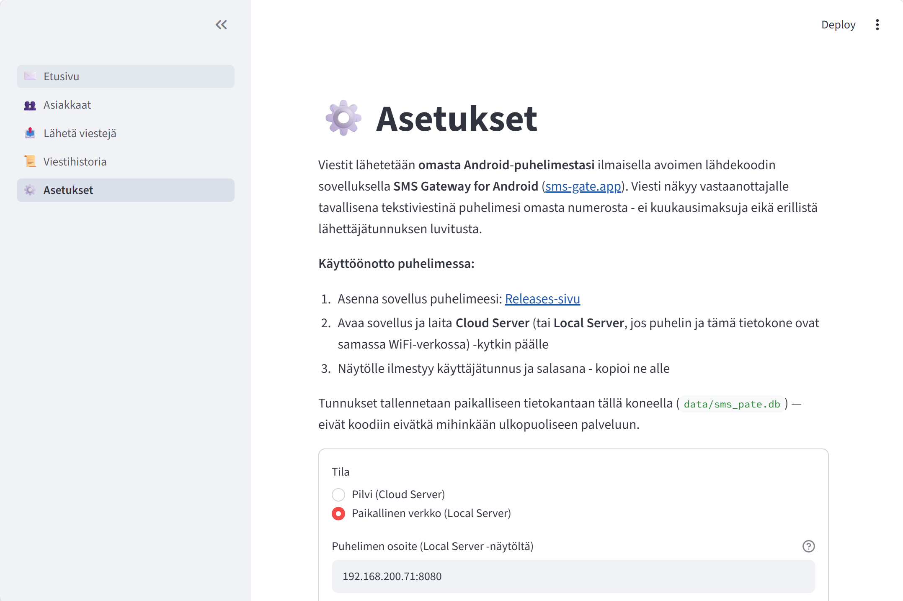

# SMS Pate

Paikallinen sovellus ryhmätekstiviestien lähettämiseen. Käyttöliittymä
avautuu selaimeen (Streamlit), mutta sovellus pyörii vain omalla koneellasi.

## Käyttöönotto

**Helpoin tapa:** tuplaklikkaa `kaynnista.bat`. Se luo virtuaaliympäristön
tarvittaessa, asentaa riippuvuudet ja käynnistää sovelluksen selaimeen.

**Tai manuaalisesti:**

1. Avaa komentorivi tässä kansiossa.
2. Luo virtuaaliympäristö (jos ei vielä ole):
   ```
   python -m venv venv
   ```
3. Aktivoi se:
   - Windows: `venv\Scripts\activate`
   - Mac/Linux: `source venv/bin/activate`
4. Asenna riippuvuudet:
   ```
   pip install -r requirements.txt
   ```
5. Käynnistä sovellus:
   ```
   streamlit run Etusivu.py
   ```
   Selain avautuu automaattisesti osoitteeseen http://localhost:8501

## Valikko

Vasemman laidan valikko: **Etusivu**, **Asiakkaat**, **Lähetä viestejä**,
**Viestihistoria**, **Asetukset**. Järjestys ja nimet määritellään
`Etusivu.py`:ssä (`st.navigation`), eivät `pages`-kansion tiedostonimillä.

## Kuvakaappaukset

*(Lisää kuvatiedostot `screenshots`-kansioon alla olevilla nimillä, niin ne näkyvät automaattisesti tässä.)*

**Etusivu**


**Asiakasrekisteri**


**Lähetä viestejä**


**Viestihistoria**


**Asetukset**


## Tila

- ✅ Etusivu: yhteenveto (asiakas- ja ryhmämäärä, lähetystilastot) ja
  pikapainike viestin lähettämiseen
- ✅ Asiakasrekisteri: lisäys, muokkaus, poisto, ryhmät (asiakas voi kuulua
  useaan ryhmään), CSV-tuonti (mallipohja `asiakaslista_malli.csv`).
  Ryhmiä luodaan vain "Ryhmät"-välilehdellä, ei muualla.
- ✅ Asetukset: puhelimen SMS Gateway -tunnukset
- ✅ Viestin kirjoitus ja ryhmälähetys (`sms_client.py`, lähetetään omasta
  Android-puhelimesta SMS Gateway for Android -sovelluksen kautta)
- ✅ Viestihistoria ja toimitusstatus (oikea toimitusvahvistus haettavissa
  "Päivitä tila puhelimelta" -painikkeella)

## Miten lähetys toimii

Sovellus **ei käytä maksullista SMS-yhdyskäytäväpalvelua**. Sen sijaan
viestit lähetetään omasta Android-puhelimesta ilmaisella avoimen
lähdekoodin sovelluksella **SMS Gateway for Android**
([sms-gate.app](https://sms-gate.app),
[lähdekoodi](https://github.com/capcom6/android-sms-gateway)). Viesti
näkyy vastaanottajalle tavallisena tekstiviestinä puhelimesi omasta
numerosta.

Etuja tälle ratkaisulle pienelle viestimäärälle (kymmeniä-satoja/kk):
- Ei kuukausimaksuja
- Viesti tulee oikeasti omasta numerosta (ei "lähettäjänimeä")
- Ei vaadi Traficomin lähettäjätunnuksen luvitusta, koska viesti
  lähtee tavallisena puhelimesta lähtevänä tekstiviestinä eikä
  yritysten SMS-yhdyskäytävärajapinnan kautta

Rajoitus: puhelimen pitää olla päällä ja verkossa lähetyshetkellä, ja
suuria määriä (tuhansia/kk) lähetettäessä operaattori voi rajoittaa
nopeutta roskapostisuodatuksen vuoksi.

### Käyttöönotto puhelimessa

1. Lataa ja asenna sovellus puhelimeen: [Releases-sivu](https://github.com/capcom6/android-sms-gateway/releases)
2. Avaa sovellus, laita **Cloud Server** päälle (tai **Local Server**,
   jos puhelin ja tietokone ovat samassa WiFi-verkossa)
3. Kopioi näytölle ilmestyvä käyttäjätunnus ja salasana sovelluksen
   Asetukset-sivulle. Local Server -tilassa riittää liittää pelkkä
   näytöllä näkyvä `IP:portti`-pari (esim. `192.168.1.50:8080`) -
   sovellus täydentää tarvittaessa `http://`-alun ja polun itse.

## Tietokanta

Asiakastiedot ja viestihistoria tallennetaan paikalliseen SQLite-tiedostoon
`data/sms_pate.db`. Tiedosto luodaan automaattisesti ensimmäisellä
käynnistyskerralla.
